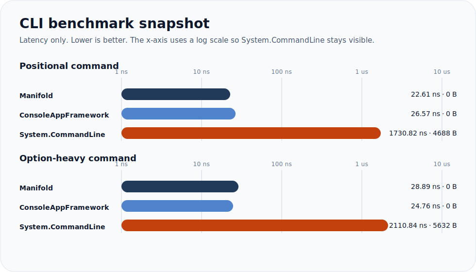
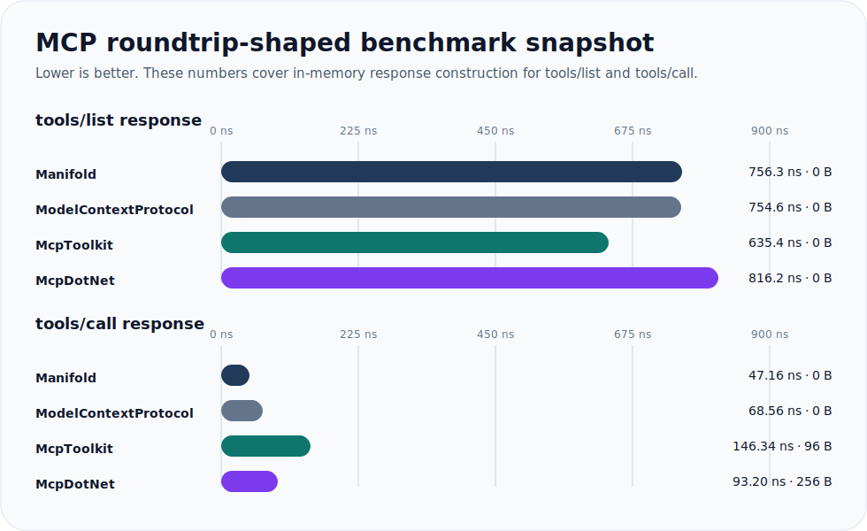

<p align="center">
  
</p>

# Manifold

[English README](README.md)

`Manifold` は、1 つの operation 定義から CLI と MCP の両方を公開するための .NET ライブラリです。

考え方はシンプルです。

- 書く operation は 1 つだけ
- descriptor や invoker は source generator が生成
- 生成された型を自分の CLI / MCP host に組み込む

`Manifold` 自体は transport や host を含みません。扱う範囲は operation 定義、binding、metadata、fast dispatch に限定しています。

動くコードをすぐ見たい場合は、repo 内の [`samples/`](samples/README.md) を参照してください。

## 含まれる package

| Package | 役割 |
| --- | --- |
| `Manifold` | core contract、descriptor、attribute、binding primitive |
| `Manifold.Cli` | CLI runtime と高速な generated invocation |
| `Manifold.Generators` | descriptor / invoker を生成する source generator |
| `Manifold.Mcp` | MCP metadata と invocation helper |

## 中心となる考え方

source of truth は operation です。

`Manifold.Generators` は、その operation から以下を生成します。

- `GeneratedOperationRegistry`
- `GeneratedCliInvoker`
- `GeneratedMcpCatalog`
- `GeneratedMcpInvoker`

consumer 側は、これらの generated type を自分のアプリケーションに組み込みます。

operation の書き方は大きく 2 通りあります。

1. static method operation
2. `IOperation<TRequest, TResult>` を実装する class-based operation

## 導入

通常は 4 package すべてを入れる必要はありません。

基本は `Manifold` と `Manifold.Generators` を入れて、必要な surface だけ追加します。

よくある組み合わせ:

| Scenario | Packages |
| --- | --- |
| operation 定義だけ使う | `Manifold`, `Manifold.Generators` |
| CLI アプリを作る | `Manifold`, `Manifold.Generators`, `Manifold.Cli` |
| MCP host を作る | `Manifold`, `Manifold.Generators`, `Manifold.Mcp` |
| CLI と MCP の両方を使う | `Manifold`, `Manifold.Generators`, `Manifold.Cli`, `Manifold.Mcp` |

CLI host の例:

```xml
<ItemGroup>
  <PackageReference Include="Manifold" Version="1.0.0" />
  <PackageReference Include="Manifold.Generators" Version="1.0.0" PrivateAssets="all" />
  <PackageReference Include="Manifold.Cli" Version="1.0.0" />
</ItemGroup>
```

MCP host の例:

```xml
<ItemGroup>
  <PackageReference Include="Manifold" Version="1.0.0" />
  <PackageReference Include="Manifold.Generators" Version="1.0.0" PrivateAssets="all" />
  <PackageReference Include="Manifold.Mcp" Version="1.0.0" />
</ItemGroup>
```

両方使う場合は、この 2 つを組み合わせれば十分です。

## Operation の定義

### Static Method 版

最も手軽に始めるなら static method が向いています。

```csharp
using Manifold;

public static class MathOperations
{
    [Operation("math.add", Summary = "Adds two integers.")]
    [CliCommand("math", "add")]
    [McpTool("math_add")]
    public static int Add(
        [Argument(0, Name = "x")] int x,
        [Argument(1, Name = "y")] int y)
    {
        return x + y;
    }
}
```

### Class-Based 版

request type を明示したい場合や、DI で管理する class にしたい場合は class-based operation が向いています。

```csharp
using Manifold;

[Operation("math.add", Summary = "Adds two integers.")]
[CliCommand("math", "add")]
[McpTool("math_add")]
public sealed class AddOperation : IOperation<AddOperation.Request, int>
{
    public ValueTask<int> ExecuteAsync(Request request, OperationContext context)
        => ValueTask.FromResult(request.X + request.Y);

    public sealed class Request
    {
        [Argument(0, Name = "x")]
        [McpName("x")]
        public int X { get; init; }

        [Argument(1, Name = "y")]
        [McpName("y")]
        public int Y { get; init; }
    }
}
```

class-based operation を使う場合は、generated invoker から呼び出される前に DI 登録が必要です。

```csharp
using Microsoft.Extensions.DependencyInjection;

ServiceCollection services = new();
services.AddTransient<AddOperation>();
ServiceProvider serviceProvider = services.BuildServiceProvider();
```

static method operation は、`[FromServices]` を使わない限り DI 登録は不要です。

## Attribute モデル

主な attribute は以下のとおりです。

| Attribute | 適用対象 | 役割 |
| --- | --- | --- |
| `[Operation("operation.id")]` | method, class | operation の正規 id を定義します。`Summary`、`Description`、`Hidden` を指定できます。 |
| `[CliCommand("group", "verb")]` | method, class | CLI 上の command path を定義します。例: `math add` |
| `[McpTool("tool_name")]` | method, class | MCP 上の tool 名を定義します。例: `math_add` |
| `[CliOnly]` | method, class | CLI にだけ公開します。 |
| `[McpOnly]` | method, class | MCP にだけ公開します。 |
| `[ResultFormatter(typeof(...))]` | method, class | CLI の text 出力を独自 formatter で上書きします。 |
| `[Argument(position)]` | parameter, request property | CLI の positional argument を定義します。`Name`、`Description`、`Required` を指定できます。 |
| `[Option("name")]` | parameter, request property | CLI の named option を定義します。`Description`、`Required` を指定できます。 |
| `[Alias(...)]` | method, class, parameter, request property | command / option / argument / name の alias を追加します。 |
| `[CliName("...")]` | method, class, parameter, request property | CLI 側だけ別名にします。 |
| `[McpName("...")]` | method, class, parameter, request property | MCP 側だけ別名にします。 |
| `[FromServices]` | parameter | ユーザー入力ではなく DI から値を解決します。 |

よくある使い方:

- `[Operation]` と surface attribute (`[CliCommand]` や `[McpTool]`) を組み合わせて使う
- 順序付きの CLI 入力は `[Argument]`、名前付きの CLI 入力は `[Option]` を使う
- surface ごとに名前を変えたい時は `[CliName]` / `[McpName]` を使う
- 片方の surface にしか出したくない時は `[CliOnly]` / `[McpOnly]` を使う
- clock や repository のような runtime service は `[FromServices]` で受ける

使用例:

- CLI だけ別名にしたいなら `[CliName("person")]`
- MCP 側の引数名を変えたいなら `[McpName("targetName")]`
- 内部向け operation を generated surface から隠したいなら `[Operation("internal.sync", Hidden = true)]`
- 特定の surface だけに公開したいなら `[CliOnly]` / `[McpOnly]`

## CLI での使い方

実行時には generated registry と generated invoker を `CliApplication` に渡します。

```csharp
using Manifold.Cli;
using Manifold.Generated;
using Microsoft.Extensions.DependencyInjection;

ServiceCollection services = new();
services.AddTransient<AddOperation>();
ServiceProvider serviceProvider = services.BuildServiceProvider();

CliApplication cli = new(
    GeneratedOperationRegistry.Operations,
    new GeneratedCliInvoker(),
    serviceProvider);

StringWriter output = new();
StringWriter error = new();

int exitCode = await cli.ExecuteAsync(
    ["math", "add", "2", "3"],
    output,
    error,
    CancellationToken.None);
```

補足:

- `CliApplication` が usage 表示と command dispatch を担います
- `GeneratedCliInvoker` が generated binding の本体です
- fast sync / fast async path が利用可能な場合は自動的にそちらを使います

## MCP での使い方

`Manifold` 自体は MCP transport host を含みません。代わりに以下を提供します。

- `GeneratedMcpCatalog` による tool metadata
- `GeneratedMcpInvoker` による tool 実行
- `Manifold.Mcp` の argument parsing helper

最小の local invocation 例です。

```csharp
using System.Text.Json;
using Manifold.Generated;
using Manifold.Mcp;
using Microsoft.Extensions.DependencyInjection;

ServiceCollection services = new();
services.AddTransient<AddOperation>();
ServiceProvider serviceProvider = services.BuildServiceProvider();

JsonElement args = JsonSerializer.Deserialize<JsonElement>(
    "{\"x\":2,\"y\":3}");

GeneratedMcpInvoker invoker = new();

if (invoker.TryInvokeFast(
        "math_add",
        args,
        serviceProvider,
        CancellationToken.None,
        out ValueTask<FastMcpInvocationResult> invocation))
{
    FastMcpInvocationResult result = await invocation;
    Console.WriteLine(result.Number);
}
```

metadata discovery の例です。

```csharp
using Manifold.Generated;

foreach (var tool in GeneratedMcpCatalog.Tools)
{
    Console.WriteLine($"{tool.Name}: {tool.Description}");
}
```

## MCP transport と sample

現在対象としている MCP transport は以下の 2 つです。

- `stdio`
- `Streamable HTTP`

`Manifold` は意図的に transport 非依存なので、core package に host は含めず、repo 内に sample host を用意しています。

- [`samples/Manifold.Samples.McpStdioHost`](samples/Manifold.Samples.McpStdioHost)
- [`samples/Manifold.Samples.McpHttpHost`](samples/Manifold.Samples.McpHttpHost)
- [`samples/README.md`](samples/README.md)

起動例:

```powershell
dotnet run --project .\samples\Manifold.Samples.McpStdioHost\Manifold.Samples.McpStdioHost.csproj
dotnet run --project .\samples\Manifold.Samples.McpHttpHost\Manifold.Samples.McpHttpHost.csproj
```

HTTP sample は `http://127.0.0.1:38474/mcp` で待ち受けます。

補足:
- HTTP sample は `ModelContextProtocol.AspNetCore` を使用します
- これは現時点では preview package です
- core の `ModelContextProtocol` 自体は stable package です

## CLI sample host

最小の CLI host も含まれています。

- [`samples/Manifold.Samples.CliHost`](samples/Manifold.Samples.CliHost)

```powershell
dotnet run --project .\samples\Manifold.Samples.CliHost\Manifold.Samples.CliHost.csproj -- math add 2 3
dotnet run --project .\samples\Manifold.Samples.CliHost\Manifold.Samples.CliHost.csproj -- weather preview --city Tokyo --days 3
```

## DI と service の利用

service を利用する方法は 2 つあります。

### Method-Based Operation

parameter に `[FromServices]` を付けます。

```csharp
[Operation("clock.now")]
[CliCommand("clock", "now")]
public static DateTimeOffset Now(
    [FromServices] IClock clock)
{
    return clock.UtcNow;
}
```

### Class-Based Operation

constructor injection を使うか、`OperationContext` から service を取得します。

```csharp
public sealed class GreetingOperation(IGreetingService greetings)
    : IOperation<GreetingOperation.Request, string>
{
    public ValueTask<string> ExecuteAsync(Request request, OperationContext context)
        => ValueTask.FromResult(greetings.Format(request.Name));

    public sealed class Request
    {
        [Option("name")]
        public string Name { get; init; } = string.Empty;
    }
}
```

## Result Formatting

CLI のテキスト出力だけを変えたい場合は `IResultFormatter<TResult>` を実装します。

```csharp
using Manifold;

public sealed class WeatherFormatter : IResultFormatter<WeatherResult>
{
    public string? FormatText(WeatherResult result, OperationContext context)
        => $"{result.City}:{result.TemperatureC}";
}
```

これを attribute で紐づけます。

```csharp
[ResultFormatter(typeof(WeatherFormatter))]
```

## 生成される型

generator は `Manifold.Generated` namespace に、少なくとも以下を生成します。

- `GeneratedOperationRegistry`
- `GeneratedCliInvoker`
- `GeneratedMcpCatalog`
- `GeneratedMcpInvoker`

通常の consumer はこれらの generated type をそのまま利用します。

## パフォーマンス

`Manifold` には `benchmarks/` 以下に BenchmarkDotNet の suite があります。

比較対象と最新のスナップショットは [`benchmarks/README.md`](benchmarks/README.md) を参照してください。

現在の比較対象:

- CLI
  - `Manifold.Cli`
  - `ConsoleAppFramework`
  - `System.CommandLine`
- MCP
  - `Manifold.Mcp`
  - official `ModelContextProtocol`
  - `McpToolkit`
  - `mcpdotnet`

現在の結果:



CLI:

| Scenario | Manifold | ConsoleAppFramework | System.CommandLine |
| --- | ---: | ---: | ---: |
| Positional command | `22.61 ns / 0 B` | `26.57 ns / 0 B` | `1730.82 ns / 4688 B` |
| Option-heavy command | `28.89 ns / 0 B` | `24.76 ns / 0 B` | `2110.84 ns / 5632 B` |

MCP roundtrip-shape:



| Scenario | Manifold | ModelContextProtocol | McpToolkit | McpDotNet |
| --- | ---: | ---: | ---: | ---: |
| `tools/list` response | `756.3 ns / 0 B` | `754.6 ns / 0 B` | `635.4 ns / 0 B` | `816.2 ns / 0 B` |
| `tools/call` response | `47.16 ns / 0 B` | `68.56 ns / 0 B` | `146.34 ns / 96 B` | `93.20 ns / 256 B` |

補足:

- CLI の数値は parser + dispatch の hot path です
- MCP の表は transport を含まない in-memory response construction の比較です
- `ModelContextProtocol` の生 invocation microbenchmark は `ZeroMeasurement` に近く、比較としては roundtrip-shape のほうが有用です

測定方法と完全なレポートは [`benchmarks/README.md`](benchmarks/README.md) を参照してください。

## Build

repo root から実行します。

```powershell
./build/restore.ps1
./build/build.ps1 -NoRestore
./build/test.ps1 -NoBuild
./build/quality.ps1
./build/pack.ps1
```

`./build/pack.ps1` は `.artifacts/packages/` に `.nupkg` と `.snupkg` を出力します。

## Repository Status

- Windows-first の script / CI
- MIT license
- CI は build / test / format / architecture / pack を検証

## OSS 向け情報

- License: [`LICENSE`](LICENSE)
- Contribution: [`CONTRIBUTING.md`](CONTRIBUTING.md)
- Third-party notices: [`THIRD_PARTY_NOTICES.md`](THIRD_PARTY_NOTICES.md)

## Repository Layout

```text
src/
  Manifold
  Manifold.Cli
  Manifold.Generators
  Manifold.Mcp
tests/
  Manifold.Tests
  Manifold.Cli.Tests
  Manifold.Generators.Tests
  Manifold.Mcp.Tests
benchmarks/
  Manifold.Benchmarks
  Manifold.Mcp.Benchmarks
samples/
  Manifold.Samples.Operations
  Manifold.Samples.CliHost
  Manifold.Samples.McpStdioHost
  Manifold.Samples.McpHttpHost
```
